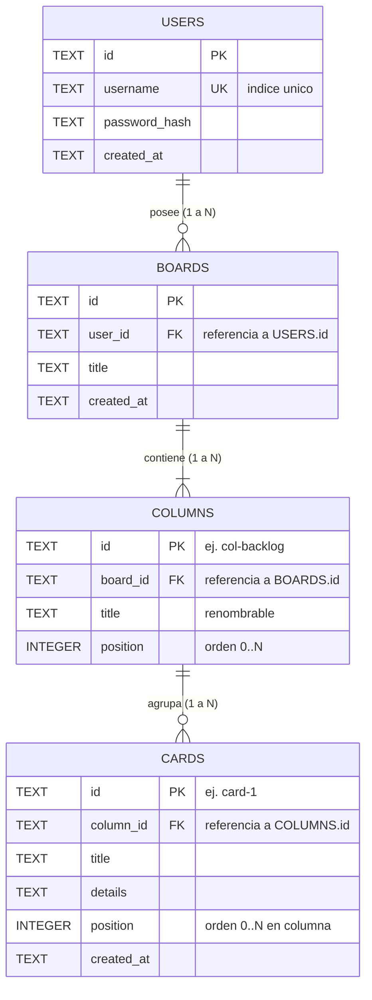

# Modelo y Arquitectura de Base de Datos

## 1. Descripcion General

El sistema de persistencia para el MVP del Tablero Kanban utiliza SQLite local. Se gestionara a traves de SQLAlchemy / SQLModel desde FastAPI, garantizando inicializacion automatica: si el archivo de base de datos (`kanban.db`) no existe al iniciar el backend, se creara el esquema y se sembraran los datos iniciales por defecto.

El diseno esta normalizado y preparado para soportar multiples usuarios y multiples tableros por usuario en futuras iteraciones, cumpliendo con la limitacion del MVP (1 usuario autenticado y 1 tablero por usuario).

---

## 2. Diagrama Entidad-Relacion (ERD)

---

## 3. Especificacion de Tablas

### 3.1 Tabla `users`
Almacena los usuarios del sistema. Permite la autenticacion simulada actual y la futura admision de multiples cuentas reales.

| Columna | Tipo | Nulo | Clave | Descripcion |
|---|---|---|---|---|
| `id` | TEXT | No | PK | Identificador unico (UUID o prefijo `user-...`) |
| `username` | TEXT | No | UK | Nombre de usuario unico |
| `password_hash` | TEXT | No | - | Contrasena o hash de autenticacion |
| `created_at` | TEXT | No | - | Fecha de creacion (ISO 8601) |

### 3.2 Tabla `boards`
Representa un tablero de proyecto. Para el MVP cada usuario tendra asignado un unico tablero principal.

| Columna | Tipo | Nulo | Clave | Descripcion |
|---|---|---|---|---|
| `id` | TEXT | No | PK | Identificador unico del tablero |
| `user_id` | TEXT | No | FK | Propietario del tablero (`users.id`, ON DELETE CASCADE) |
| `title` | TEXT | No | - | Titulo del tablero (ej. "Tablero Principal") |
| `created_at` | TEXT | No | - | Fecha de creacion (ISO 8601) |

### 3.3 Tabla `columns`
Define las etapas o fases del flujo de trabajo del tablero. Los titulos son editables y el orden se mantiene mediante `position`.

| Columna | Tipo | Nulo | Clave | Descripcion |
|---|---|---|---|---|
| `id` | TEXT | No | PK | Identificador de columna (ej. `col-backlog`) |
| `board_id` | TEXT | No | FK | Tablero contenedor (`boards.id`, ON DELETE CASCADE) |
| `title` | TEXT | No | - | Titulo editable de la columna |
| `position` | INTEGER | No | - | Posicion ordinal dentro del tablero (0..4) |

### 3.4 Tabla `cards`
Almacena las tarjetas de tareas individuales, asociadas a una columna especifica con su orden relativo.

| Columna | Tipo | Nulo | Clave | Descripcion |
|---|---|---|---|---|
| `id` | TEXT | No | PK | Identificador de la tarjeta (ej. `card-1`) |
| `column_id` | TEXT | No | FK | Columna donde reside (`columns.id`, ON DELETE CASCADE) |
| `title` | TEXT | No | - | Titulo de la tarjeta |
| `details` | TEXT | No | - | Descripcion detallada de la tarea |
| `position` | INTEGER | No | - | Posicion ordinal dentro de la columna |
| `created_at` | TEXT | No | - | Fecha de creacion (ISO 8601) |

---

## 4. Integridad Referencial y Reglas de Negocio

1. **Eliminacion en cascada**:
   - Si se elimina un usuario, se eliminan sus tableros asociados (`ON DELETE CASCADE`).
   - Si se elimina un tablero, se eliminan sus columnas asociadas (`ON DELETE CASCADE`).
   - Si se elimina una columna, se eliminan sus tarjetas asociadas (`ON DELETE CASCADE`).

2. **Reordenacion de tarjetas (Drag & Drop)**:
   - Mover una tarjeta dentro de la misma columna actualiza el campo `position` de las tarjetas afectadas.
   - Mover una tarjeta a otra columna actualiza tanto `column_id` como `position`.

3. **Renombrado de columnas**:
   - Se actualiza el campo `title` de la columna objetivo sin afectar las tarjetas contenidas.

---

## 5. Estrategia de Inicializacion y Sembrado (Seed)

Al arrancar el servidor FastAPI:
1. Se verifica la existencia del archivo de base de datos SQLite (por defecto en `backend/data/kanban.db`).
2. Si el archivo no existe o las tablas no estan creadas:
   - Se ejecuta `Base.metadata.create_all(bind=engine)`.
   - Se insertan los usuarios por defecto:
     - `user` con contrasena `password`.
     - `usuario` con contrasena `contraseña`.
   - Se crea el tablero inicial para cada usuario con las 5 columnas por defecto:
     - `Backlog` (posicion 0)
     - `Discovery` (posicion 1)
     - `In Progress` (posicion 2)
     - `Review` (posicion 3)
     - `Done` (posicion 4)
   - Se cargan las tarjetas iniciales de demostracion distribuidas en las columnas correspondientes.

El esquema formal en formato JSON se encuentra disponible en `docs/schema.json`.
